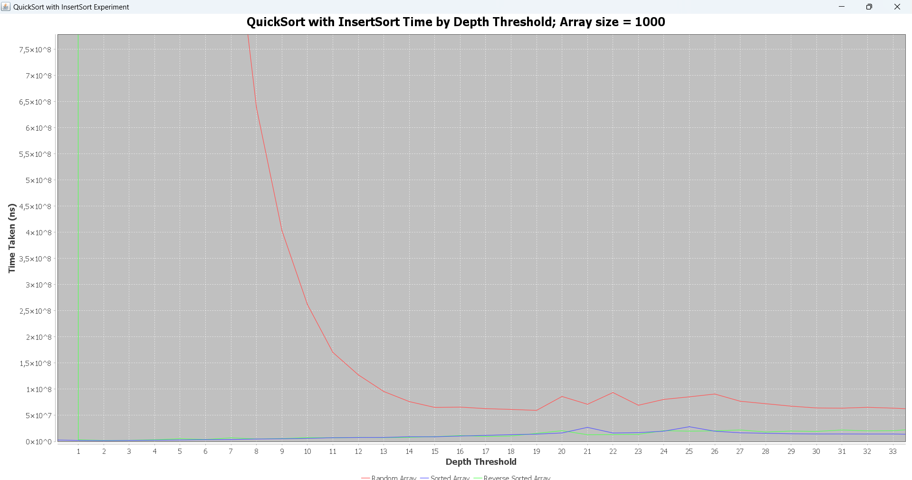
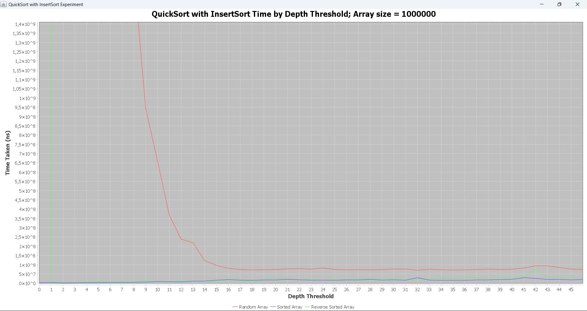
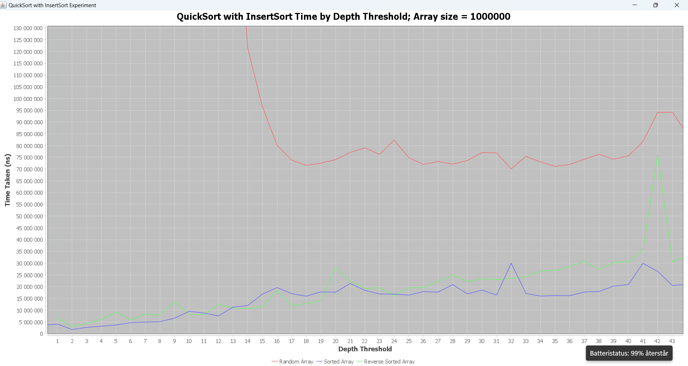
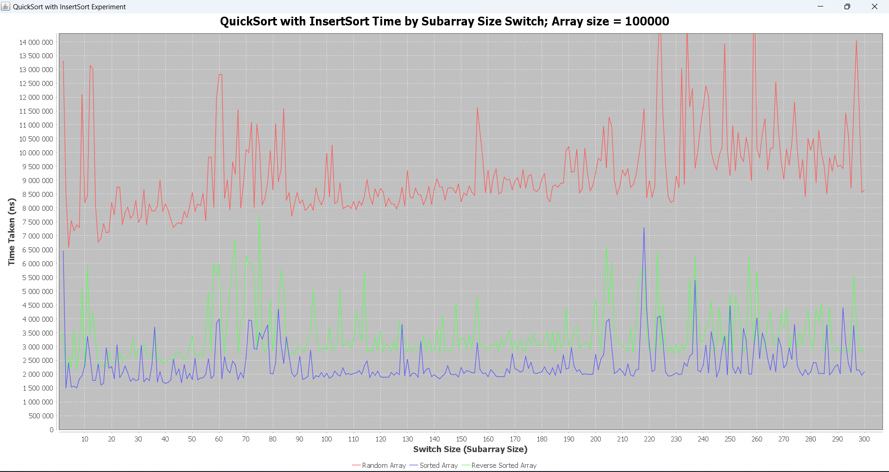

# Programmeringsuppgift 3
## Overview

This project implements various data structures and algorithms related to sorting and graph theory. The primary objectives include implementing Quicksort with a pivot selection strategy, creating directed and undirected graph ADTs using adjacency lists, and performing search algorithms and shortest path calculations.

## Contents

- [Task 1: Quicksort Implementation](#task-1-quicksort-implementation)
- [Task 2: Graph ADT Implementation](#task-2-graph-adt-implementation)
- [Task 3: Search Algorithms](#task-3-search-algorithms)
- [Task 4: Dijkstra's Algorithm](#task-4-dijkstras-algorithm)
- [Experiments and Results](#experiments-and-results)

## Task 1: Quicksort Implementation

- Implemented the Quicksort algorithm using the median of three method to determine the pivot.
- The implementation includes a `depth` parameter that indicates the depth at which to switch to either Insertion Sort or Heapsort.
- Conducted experiments to determine the optimal `depth` value based on list length.

## Task 2: Graph ADT Implementation

- Created two classes for directed and undirected graphs that inherit from a common base class.
- Implemented adjacency lists to represent the graphs.
- Supported operations include counting nodes, counting edges, adding and removing edges, and determining the degree of nodes.
- Included iterators for nodes, edges, and adjacency.

## Task 3: Search Algorithms

- Implemented depth-first search (DFS) and breadth-first search (BFS) for both directed and undirected graphs.
- Provided methods to check if there is a path between two nodes and iterators to traverse such paths.

## Task 4: Dijkstra's Algorithm

- Implemented Dijkstra's algorithm to find the shortest path from a specified node to all other nodes in the graph.
- Utilized a priority queue for efficient edge relaxation.

## Experiments-and-results
Hybrid Sorting Algorithm: QuickSort with switch to Insert Sort
## Introduction
This project implements a hybrid sorting algorithm that combines QuickSort with Insertion Sort or Heap Sort. The goal is to improve the efficiency of QuickSort by switching to a more suitable sorting algorithm at a certain recursion depth or subarray size. Specifically, QuickSort is efficient for larger lists, but for small subarrays, Insertion Sort and Heap Sort have lower overhead and perform better.

This project investigates how the recursion depth and subarray size influence the optimal point to switch between QuickSort and other sorting algorithms.

## How It Works
QuickSort is a **divide-and-conquer** algorithm that works by recursively partitioning an array into two subarrays based on a pivot element. The pivot can be chosen in various ways, but for this experiment, I used the **median of three** strategy for better performance. The pivot ensures that all elements smaller than it are moved to the left, and all elements greater are on the right. 

The term **"depth"** in this context refers to the level of recursion — how many times the QuickSort function calls itself. If QuickSort is recursively applied to an array of length `n`, it will divide the list until it reaches subarrays of size one, and the depth will be at most `O(log n)` in balanced cases, or `O(n)` in the worst case.

When the recursion depth reaches a certain threshold, continuing to divide the array further can become inefficient due to the overhead of recursive calls. That’s why I switch to **Insertion Sort** when the subarray is small enough. Insertion Sort is more efficient on small or nearly sorted arrays due to its low overhead.

## Experimental Setup
I ran experiments to determine the optimal switchSize and the depth threshold at which QuickSort switches to Insertion Sort. I tested the algorithm on different types of arrays:
- **Random Array**
- **Sorted Array**
- **Reverse Sorted Array**

The experiment was run with varying depth thresholds and swiching determined by  current array sizes that is beeing sorted to measure the time taken for sorting using a combination of QuickSort and Insertion Sort. The process was repeated for different input sizes to ensure consistency.

### Code Implementation
- [Insert Sort](./a3-sort/src/main/java/com/example/insertsort/InsertSort.java): Implemented to be efficient on smaller subarrays. It sorts in-place by shifting larger elements one position ahead to make space for the smaller element.

- QuickSort: The algorithm is enhanced with two variants:

1. [Depth Threshold](./a3-sort/src/main/java/com/example/quicksort/QuickSortWithDepthTreshold.java): Switches to Insertion Sort if the recursion depth exceeds a predefined threshold.
2. [Subarray Size Threshold](./a3-sort/src/main/java/com/example/quicksort/QuickSortWithSwichSize.java): Switches to Insertion Sort when the size of the sublist being sorted is small enough.

## Analysis

The goal was to determine the optimal depth at which the algorithm should switch from QuickSort to Insertion Sort. Based on my experiments, I found the following:

## Results

- **Smaller Arrays (size = 1,000)**:
  - The optimal depth treshold fluctuated, leading to inconsistent performance.
  - Random peaks were observed, especially for reverse sorted arrays (red line), indicating that QuickSort struggles with worst-case inputs, even with depth control.

- **Larger Arrays (size = 100,000)**:
  - A consistent pattern emerged where the random array (red line) showed a sharp drop in time taken as the threshold increased.
  - Performance stabilized around a depth of 14.
  - For sorted and reverse sorted arrays (green and blue lines), performance remained steady across different thresholds, showing that Insertion Sort is effective for smaller and nearly sorted subarrays.

The formula for the depth threshold in QuickSort is dependent on the array size n. Based on the experiment, the optimal depth threshold d can be approximated using the following formula:
d = log2n − k

Where:
- n is the size of the array.
- k is an experimentally determined constant that accounts for the computational overhead of recursive calls.

For subarray size switching, we conducted tests for array sizes up to 100,000 elements. The optimal subarray size threshold is influenced by the nature of the array (whether it's random, sorted, or reverse sorted).

The optimal subarray size S for switching to Insertion Sort can be approximated as:
S ≈ n/log(n) 

Where:
- n is the total array size.

This formula was found to yield good performance across different types of arrays, balancing the efficiency of QuickSort for large subarrays and Insertion Sort for small subarrays.

## Graphical Results

The experiments are plotted using JFreeChart to visualize the relationship between depth thresholds, subarray sizes, and the time taken for sorting.

- Random Arrays: Optimal depth threshold was found around log2{n} - 3, meaning the switch to Insertion Sort should happen slightly earlier than log(n) depth.

- Sorted and Reverse Sorted Arrays: These arrays exhibit different behaviors, with sorted arrays benefiting from larger depth thresholds and reverse sorted arrays needing smaller thresholds to optimize time.

- For subarray size switching: Switch to Insertion Sort when subarray size reaches approximately n / log(n).

## Observations

- **Choosing the Depth Threshold**:
  - Setting a `switchSize` around 10-15 resulted in the best performance across all types of input arrays.
  - This aligns with the theoretical recommendation to switch to a simpler sorting algorithm for subarrays smaller than 10-20 elements.

- **Why Depth Matters**:
  - Initially, I was confused as to why the experiment relied on a depth threshold rather than subarray size.
  - Understanding that each recursive call increases the depth clarified that using depth allows for a consistent and scalable switch, as deeper calls correspond to smaller subarrays.

## Additional Note

- For the arrays tested, the maximum depth never reached 50, but a range up to 50 was used as a warm-up to ensure that all potential depth thresholds were covered.
